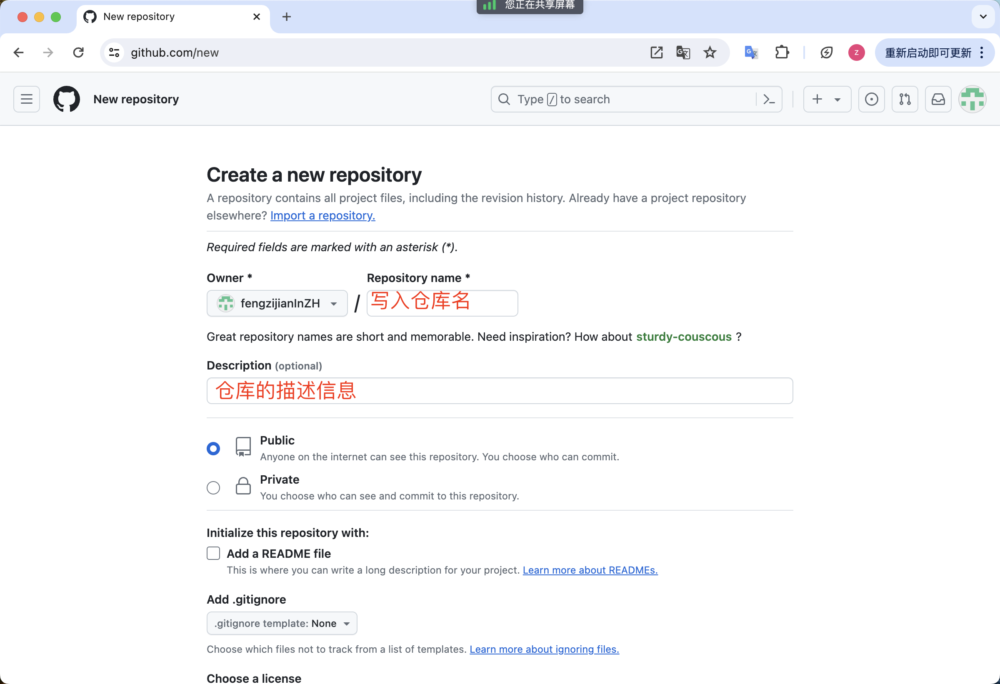

# 学习 Git

## 如何将普通目录标记为 Git 仓库

初始化项目：`git init`

## 定义提交者信息

作者姓名：`git config user.name "你的名字"`  
作者邮箱：`git config user.email "你的邮箱"`

## 如何查看仓库状态

`git status`

## 如何添加文件到暂存区

提交单个文件：`git add <文件>`
提交所有文件：`git add .`

## 如何将暂存区的文件移除

移除单个文件：`git rm --cached <文件>`
移除所有文件：`git rm --cached *`

## 创建提交记录

`git commit -m "提交信息"`

## 如何查看提交记录

`git log`

## 创建远程仓库

## 查看当前分支
`git branch -v`

## 上传本地仓库到远程仓库

创建快捷方式：`git remote add origin <远程仓库地址>`  
将本地仓库上传到远程仓库：`git push -u origin master`

-u 参数表示将本地仓库和远程仓库关联起来，以后只需要执行 `git push` 就可以上传到远程仓库了。

## 克隆远程仓库到电脑

`git clone <仓库地址>`

## 拉取远程仓库到本地

`git pull --rebase`
